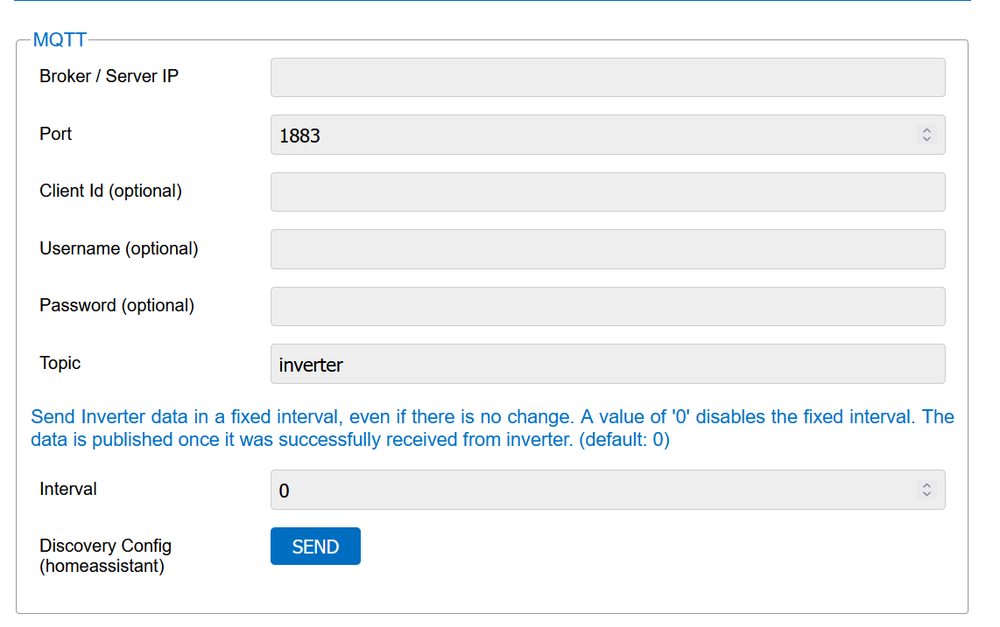

MqTT
######

Optional kann in Ahoy ein MqTT-Broker angegeben werden, der regelmäßig mit aktuellen Daten versorgt wird. Für Homeassistant gibt es das ``Autodiscover`` Feature, um automatisch ein Ahoy-DTU Gerät anzulegen.

.. note::

   Die Topics werden zZt. überarbeitet, d.h. es können sich die Anzahl sowie auch der Inhalt der Topics noch ändern.

.. note::

   Das langfristige Ziel ist die Daten im wesentlichen mittels wenigen Topics und einer JSON Struktur zu übertragen. Dies wurde bisher nur in geringen Teilen umgesetzt.

Übersicht
***********

In den Einstellungen von Ahoy beinhalten eine Sektion ``MqTT`` (hier zu sehen sind die Standardeintellungen):

Um die MqTT Übertragung einzurichten muss mindestens neben dem schon vorgegebenen ``Topic`` auch ein ``Broker`` angegeben werden. Hierfür am besten die lokale IP-Adresse des MqTT-Brokers angeben. Je nach Konfiguration des Brokers muss auch noch der ``Benutzer`` und das ``Passwort`` angegeben werden.
Die ``Client ID`` gibt an, unter welchem Namen sich AhoyDTU bei dem MqTT-Broker meldet. Ist das Feld leer, wird automatisch eine einzigartige Client-ID erzeugt.

.. note::

   Eine verschlüsselte Übertragung wird derzeit (noch) nicht unterstützt.

Übermittelte Topics
*********************

Ansteuerung
*************

Inverter neustarten
=====================

Jeder Inverter kann einzeln neu gestartet werden. Es gibt keine Bestätigung über den Erfolg.

.. code-block:: bash

    <TOPIC>/ctrl/restart/<INVERTER_ID>

.. autosummary::
   :toctree: generated

   lumache
