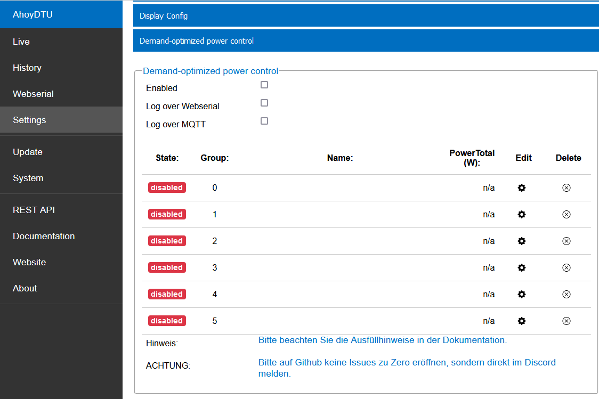
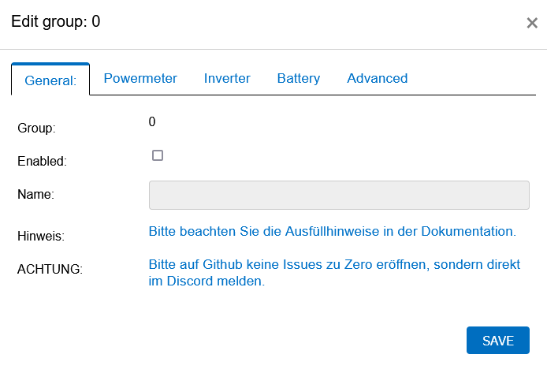
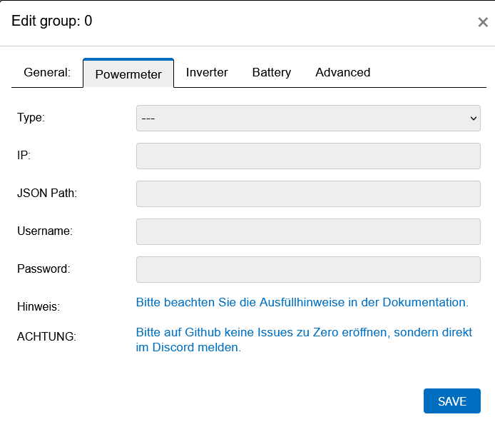
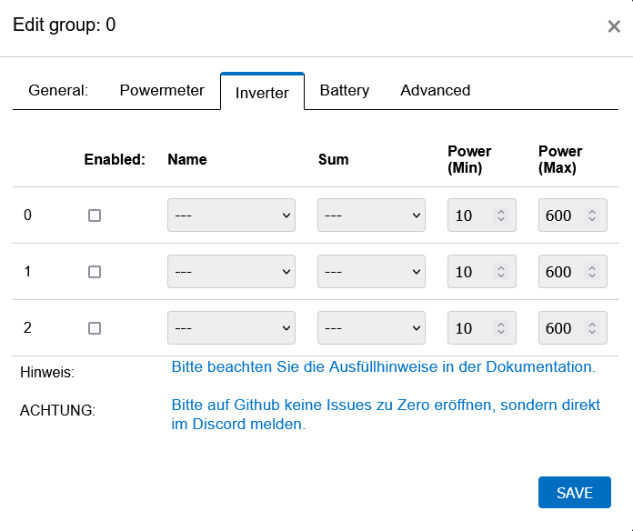
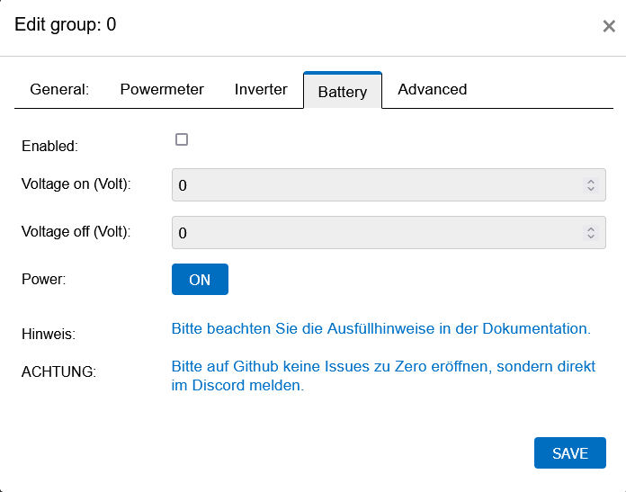
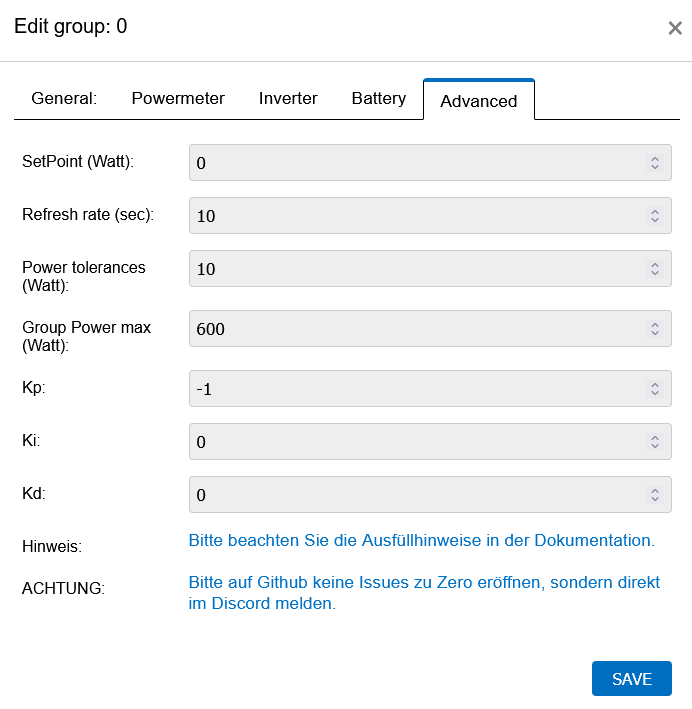

Bedarfsoptimierte Leistungsregelung
#####################################

Das Modul "Bedarfsoptimierte Leistungsregelung" ergänzt Ahoy um die Möglichkeit nur so viel Leistung(Strom) zu erzeugen wie im Haus benötigt wird.

Um das zu ermöglichen, wird die Leistung am Übergabepunkt (Zähler) gemessen und die Wechselrichter entsprechend geregelt.

Konfiguration
***************

Die Einstellungen von Ahoy beinhalten eine Sektion ``Bedarfsoptimierte Leistungsregelung`` (hier zu sehen sind die Standardeintellungen):

Um die Bedarfsoptimierte Leistungsregelung zu aktivieren, ...

Log
*****

Die Bedarfsoptimierte Leistungsregelung hat zwei verschiedene Debugmöglichkeiten, die in der Konfiguration aktiviert werden können.
- Log over Webserial
- Log over MQTT

Dabei werden je nach Modul der Regelung unterschiedliche JsonDatensätze ausgegeben.

.. code-block:: bash

    ze: {"group":0,"type":"groupWaitRefresh","B":45930169,"next":"GETINVERTERACKS","E":45930169,"D":0}

.. code-block:: bash

    ze: {"group":0,"type":"groupGetInverterAcks","B":45930171,"iv":[{"id":0},{"id":1},{"id":2}],"wait":false,"E":45930172,"D":1}

.. code-block:: bash

    ze: {"group":0,"type":"groupGetInverterData","B":45930185,"iv":[{"id":0},{"id":1},{"id":2}],"E":45930186,"D":1}

.. code-block:: bash

    ze: {"group":0,"type":"groupBatteryprotection","B":45930199,"en":true,"inv":3,"U":52.29999924,"action":"On","err":"battSwitch 1 == isProducing()1","sw":true,"E":45930200,"D":1}

.. code-block:: bash

    ze: {"group":0,"type":"groupGetPowermeter","B":45930213,"mod":"getPowermeterWattsShelly","HTTP_URL":"http://172.16.16.31/status","P":-440.6900024,"P1":-589.0300293,"P2":60.77000046,"P3":87.56999969,"E":45930275,"D":62}

.. code-block:: bash

    ze: {"group":0,"type":"groupController","B":45930288,"w":30,"x":-440.6900024,"x1":-589.0300293,"x2":60.77000046,"x3":87.56999969,"e":470.6900024,"e1":619.0300293,"e2":-30.77000046,"e3":-57.56999969,"Kp":-0.477999985,"Ki":0,"Kd":0,"Ta":5120,"yP":-224.9898071,"yP1":-295.8963318,"yP2":14.70805931,"yP3":27.51845932,"esum":-402851.5625,"esum1":115841.5703,"esum2":-331159.2813,"esum3":-10893.54199,"yI":0,"yI1":0,"yI2":0,"yI3":0,"ealt":1404.369995,"ealt1":1230.380005,"ealt2":270.3099976,"ealt3":-36.31999969,"yD":0,"yD1":0,"yD2":0,"yD3":0,"yPID":-224.9898071,"yPID1":-295.8963318,"yPID2":14.70805931,"yPID3":27.51845932,"E":45930289,"D":1}

.. code-block:: bash

    ze: {"group":0,"type":"groupPrognose","B":45930344,"E":45930344,"D":0}

.. code-block:: bash

    ze: {"group":0,"type":"groupAufteilen","B":46662266,"y":-628.1015625,"y1":-629.8510742,"y2":-48.92329788,"y3":21.99278069,"0":"0 grpTarget: 0: ivPmin: 65535: ivPmax: 0: ivId_Pmin: 0: ivId_Pmax: 0","1":"1 grpTarget: 0: ivPmin: 65535: ivPmax: 0: ivId_Pmin: 0: ivId_Pmax: 0","2":"2 grpTarget: 1: ivPmin: 50: ivPmax: 50: ivId_Pmin: 1: ivId_Pmax: 1","3":"3 grpTarget: 1: ivPmin: 70: ivPmax: 70: ivId_Pmin: 2: ivId_Pmax: 2","4":"4 grpTarget: 0: ivPmin: 65535: ivPmax: 0: ivId_Pmin: 0: ivId_Pmax: 0","5":"5 grpTarget: 0: ivPmin: 65535: ivPmax: 0: ivId_Pmin: 0: ivId_Pmax: 0","6":"6 grpTarget: 0: ivPmin: 65535: ivPmax: 0: ivId_Pmin: 0: ivId_Pmax: 0","103":"3","+deltaP":21.99278069,"102":"2","-deltaP":-48.92329788,"E":46662267,"D":1}

.. code-block:: bash

    ze: {"group":0,"type":"groupSetLimit","B":45930422,"inv":2,"limit":116,"wait":60,"data":{"val":116,"id":3,"path":"ctrl","cmd":"limit_nonpersistent_absolute"},"E":45930423,"D":1}

.. code-block:: bash

    ze: {"group":0,"type":"resetWaitLimitAck","B":45931128,"id":2,"inv":1,"wait":0,"E":45931128,"D":0}

.. code-block:: bash

    ze: {"group":0,"type":"newDataAvailable","B":45930845,"avail":true,"id":3,"inv":2,"zeL":116,"ivL":88,"ivPm":400,"ivL%":22,"E":45930846,"D":1}
